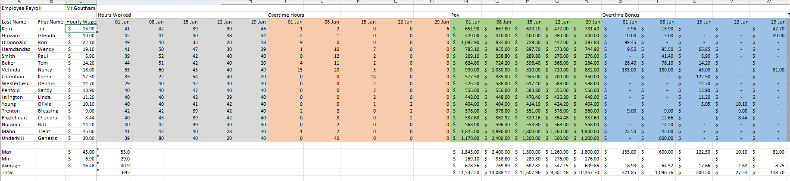
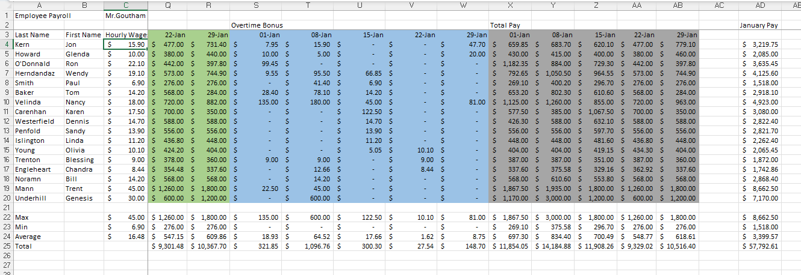

# Payroll Management System (Excel Project)

## 📌 Overview
This project is built using Microsoft Excel to manage employee payroll data efficiently.

## 📊 Features
- Employee salary calculation
- Automated payroll processing
- Use of formulas and functions
- Organized data management

## 🛠 Tools Used
- Microsoft Excel

## 📂 File Included
- PAYROLL.xlsx

## 📈 Key Functions Used
- SUM()
- IF()
- VLOOKUP()
- COUNT()

## 💡 Insights
- Helps track employee salaries
- Reduces manual calculation errors
- Improves payroll efficiency

## 📸 Screenshots

## 👨‍💻 Author
GUNDA GOUTHAM
